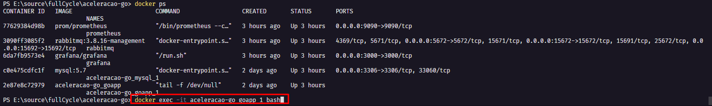
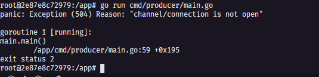
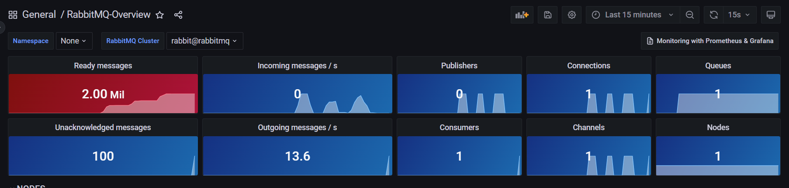
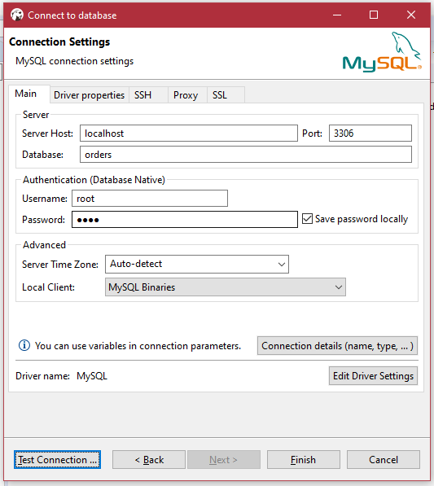
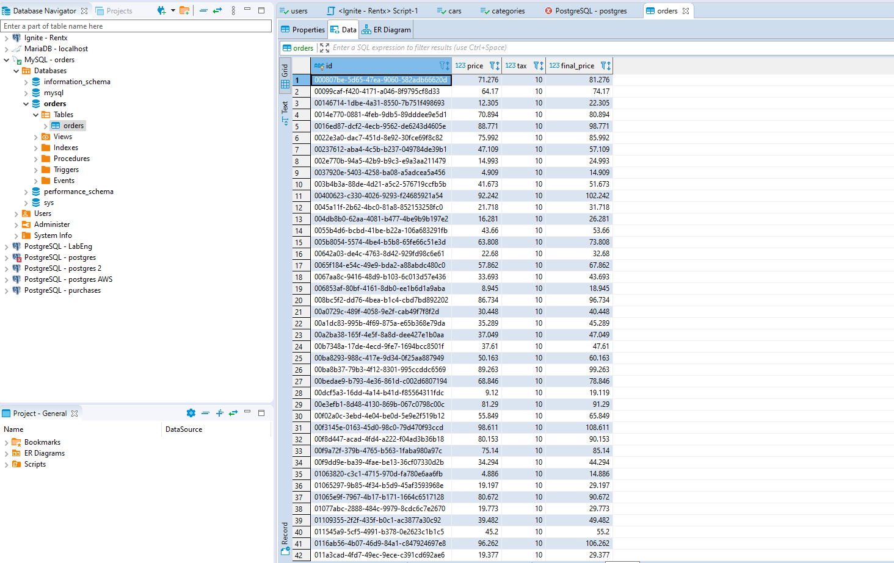

<p align="center">
  <a href="https://fullcycle.com.br/" target="blank"></a>
</p>

# PFA Go

## Descrição do Projeto

Esse projeto corresponde a um producer e um consumer de uma fila do rabbitmq utilizando golang.
O Prometheus fica acessando o rabbitmq a cada tanto segundos e pega as metricas do rabbit mq

## Passos para execução do desafio

<h3>1 - Passo > Subir os containers no docker</h3>

```bash
docker-compose up -d
```
</br>
<h3>2 - Passo > Acessar o Prometheus na porta 9090</h3>

- Config prometheus.yml


- Ir na aba status/targets e analisar que o prometheus esta visualzando o rabbitmq


</br>
<h3>3 - Passo > Acessar o Grafana na porta 3000</h3>
Logar com o username admin e senha admin.
Apos isso eh necessario configurar o grafana pra acessar o prometheus e buscar as informacoes do rabbitmq

- Adicionar novo data source


- Selecionar Prometheus


- Adicionar o caminho do Prometheus


- Acessar o site do grafana: <a href="https://grafana.com">https://grafana.com</a>  e buscar o dashboard do rabbitmq e copiar o id


- Importar esse Id na pagina do grafana no localhost:3000


</br>
<h3>4 - Passo > Acessar o Rabbitmq na porta 15672</h3>
- Logar com o username guest e senha guest e criar a fila de maneira manual

- Ir na aba queue e adicionar a fila orders


- Ir na aba exchanges na exchange na exchange amq.direct e fazer o bind com a queue orders


 

</br>
<h3>5 - Passo > Acessar o go_app e executar os producers</h3>




```bash
   go run cmd/producer/main.go
```

- Analisar no grafana após execução do producer:


</br>
<h3>6 - Passo > Acessar o go_app e executar os producers</h3>


```bash
   go run cmd/main.go
```

- Imagem do grafana após funcionamento do consumer




<h3>7 - Passo > Acessar MySql e ver se as orders estão sendo cadastradas</h3>





# Author

<table>
   <tr>
      <td align="center">
         <a href="http://github.com/lhfam97/">
            
            <br />
            <sub>
               <b>Luís Henrique Machado</b>
            </sub>
          </a>
          <br />
          <a href="https://www.linkedin.com/in/luís-henrique-machado-98037a127/" title="Linkedin">@luishenriquemachado</a>
          <br />
          <a href="https://github.com/lhfam97/fastfeet-api/commits?author=lhfam97" title="Code">💻</a>
      </td>
   </tr>
</table>
